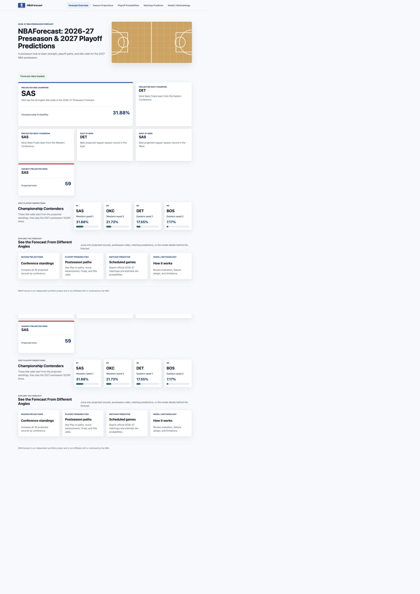
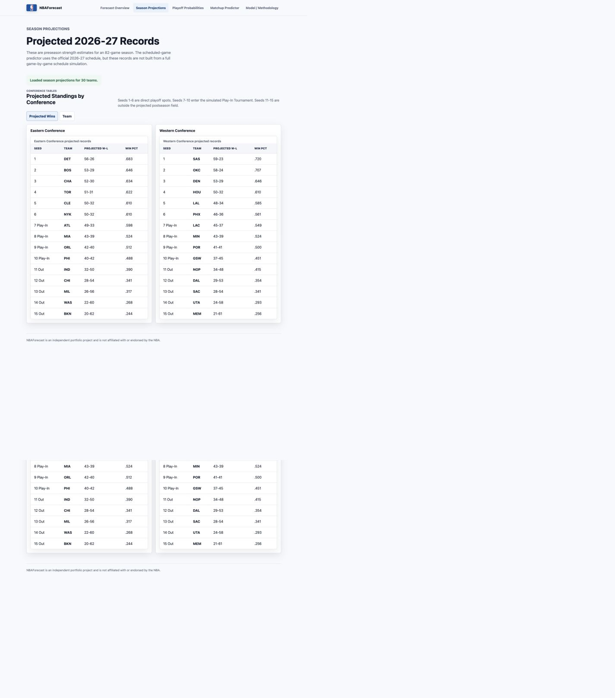
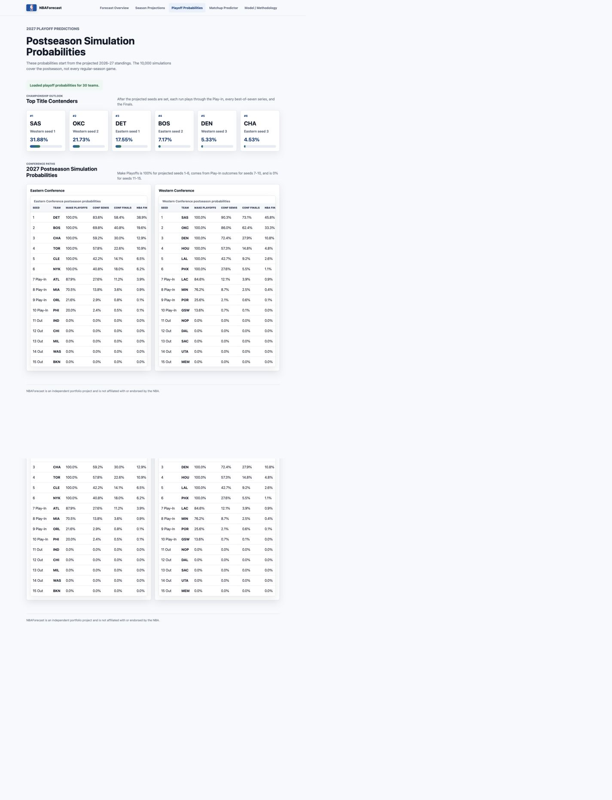
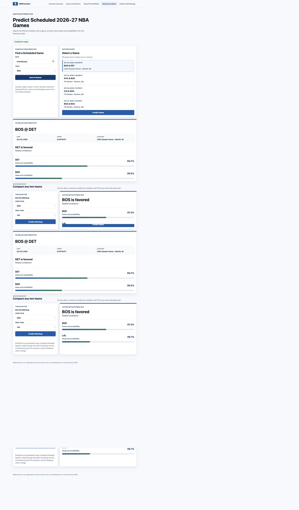

# NBA Forecast
NBAForecast is an AI-trained model which can predict NBA game outcomes, 2026-27 team records, the 2027 postseason, and also serves an interactive scheduled-game predictor. The project combines machine learning, Monte Carlo simulation, backend APIs, and a responsive web frontend.

## Key Features
- 2026-27 preseason team projections
- Projected Eastern and Western Conference standings
- 2027 playoff advancement and championship probabilities
- 10,000-run Monte Carlo postseason simulation
- Interactive scheduled-game predictor
- Official 2026-27 NBA schedule integration
- Date and team game filtering
- Predicted winner, win probabilities, and confidence label
- Model performance analysis on an unseen chronological holdout
- Responsive multi-page frontend

## Dataset
The historical modeling data covers NBA regular-season games from 2018-19 through 2025-26. After cleaning, the model uses 9,509 one-row-per-game records.

Neutral-site games that could not be represented consistently as one home team and one away team were excluded from the home-vs-away modeling dataset. The official 2026-27 NBA schedule is used for scheduled-game lookup and prediction. Schedule rows require known home and away teams; unresolved placeholder rows are not filled manually. The schedule is not used as completed game-result data for training.

## Feature Engineering
The model uses 84 leakage-safe pregame features. They describe each home and away team before tipoff, including:
- Last-5, last-10, and last-20 rolling performance
- Win percentage
- Scoring, points allowed, and point differential
- Shooting percentages
- Rebounds, assists, steals, blocks, and turnovers
- Season-to-date performance
- Rest days and back-to-back context

Rolling and expanding calculations use `shift(1)` before feature creation. That means the current game's result and box score are not allowed to leak into the predictors for that game.

## Model Development
Model development uses a chronological split:
- Training/model-development seasons: 2018-19 through 2024-25
- Unseen holdout season: 2025-26

Models compared:
- Dummy baseline
- Logistic Regression
- Random Forest
- HistGradientBoosting

The final selected model is a scaled Logistic Regression pipeline with median imputation. Probability quality was the main selection criterion because game probabilities feed the postseason simulator.

## Model Performance
Logistic Regression holdout performance on the unseen 2025-26 season:

| Metric | Value |
| --- | ---: |
| Accuracy | 66.29% |
| ROC AUC | 0.724 |
| Log Loss | 0.610 |
| Brier Score | 0.211 |

Logistic Regression was selected primarily because it had the best Log Loss and Brier Score among the evaluated non-dummy models. Accuracy mattered, but calibrated probabilities were more important for simulation.

## Production Model
After model selection, the final production Logistic Regression model was retrained on all 9,509 cleaned games from 2018-19 through 2025-26.

## 2026-27 Forecasting
Preseason team states are based on completed performance through the 2025-26 season. Projected records estimate future team strength over an 82-game season.

The current projected records are model-implied strength estimates. They are not produced by replaying every game on the official 2026-27 schedule. The official schedule is integrated separately for scheduled-game lookup and prediction. For a selected game, the backend uses the actual game date, time, arena, city, home team, and away team from the schedule, and it can use the schedule to set rest-day and back-to-back context.

## Postseason Simulation
The postseason simulation starts from projected conference seeds. Seeds 1-6 are treated as automatic playoff qualifiers. Seeds 7-10 enter a simulated Play-In Tournament. Seeds 11-15 are outside the projected postseason field.

Each playoff series is simulated as a best-of-seven using the NBA 2-2-1-1-1 home-court format. The simulator runs 10,000 postseasons and tracks advancement probabilities through the Conference Semifinals, Conference Finals, NBA Finals, and championship.

Postseason probabilities are conditional on the projected regular-season standings. The current code does not simulate uncertainty across the full 82-game regular season.

## Interactive Game Predictor
The web app includes a scheduled-game predictor. Users can search actual 2026-27 scheduled games by date or team, select a game, and view:

- Game date and tipoff time
- Arena and location
- Official home and away teams
- Home and away win probabilities
- Predicted winner
- Confidence label

The frontend also includes a Custom Matchup mode for comparing any two teams outside the schedule flow.

## Project Architecture
```text
Raw NBA data
→ Cleaning
→ Leakage-safe feature engineering
→ Chronological model evaluation
→ Production model
→ Team-state forecasting
→ Monte Carlo postseason simulation
→ FastAPI prediction backend
→ Frontend dashboard
```

## Technology Stack
- Python
- pandas
- NumPy
- scikit-learn
- nba_api
- joblib
- FastAPI
- Uvicorn
- HTML
- CSS
- JavaScript
- matplotlib
- Git / GitHub

## How to Run
Run these commands from the project root.

1. Install dependencies:
```bash
python3 -m pip install pandas numpy scikit-learn nba_api joblib fastapi uvicorn matplotlib
```

2. Start the backend API:
```bash
uvicorn backend.app:app --reload --port 8001
```

3. In a second terminal, start the static frontend server:
```bash
python3 -m http.server 8000
```

4. Open the site:
```text
http://localhost:8000/frontend/
```

The frontend expects the backend at `http://localhost:8001`.

## Project Structure
```text
.
├── backend/
│   └── app.py                         # FastAPI prediction API
├── data/
│   ├── nba_games_raw.csv
│   ├── nba_games_2025_26_raw.csv
│   ├── nba_games_clean.csv
│   ├── nba_features.csv
│   ├── model_evaluation.csv
│   ├── holdout_predictions.csv
│   ├── season_2026_27_predictions.csv
│   ├── 2027_projected_standings.csv
│   ├── 2027_playoff_probabilities.csv
│   ├── forecast_2026_27_summary.json
│   └── nba_schedule_2026_27.csv
├── frontend/
│   ├── index.html                     # Forecast overview
│   ├── season.html                    # Season projections
│   ├── bracket.html                   # Playoff probabilities
│   ├── predict.html                   # Scheduled-game predictor
│   ├── methodology.html               # Model and methodology
│   ├── script.js
│   └── style.css
├── models/
│   ├── nba_win_model.joblib
│   ├── nba_win_model_holdout.joblib
│   └── feature_columns.joblib
├── notebooks/
│   └── final_analysis.ipynb           # Final analysis notebook
└── scripts/
    ├── nba_data.py
    ├── download_2025_26_games.py
    ├── download_2026_27_schedule.py
    ├── build_dataset.py
    ├── build_features.py
    ├── train_model.py
    ├── retrain_model.py
    └── generate_2026_27_forecast.py
```

## Limitations
- Injuries are not directly modeled.
- Every offseason roster change is not fully modeled.
- Player-level context is not yet directly incorporated into the team model.
- Forecasts are probabilistic, not guarantees.
- Historical performance does not guarantee future outcomes.

## Future Improvements
- Player search and player-stat prediction
- Player-level injury and availability inputs
- Roster continuity and transaction modeling
- Dynamic updates as 2026-27 results become available
- Stronger calibration and model tuning

## Results / Screenshots
### Forecast Overview


### Season Projections


### Playoff Probabilities


### Game Predictor

